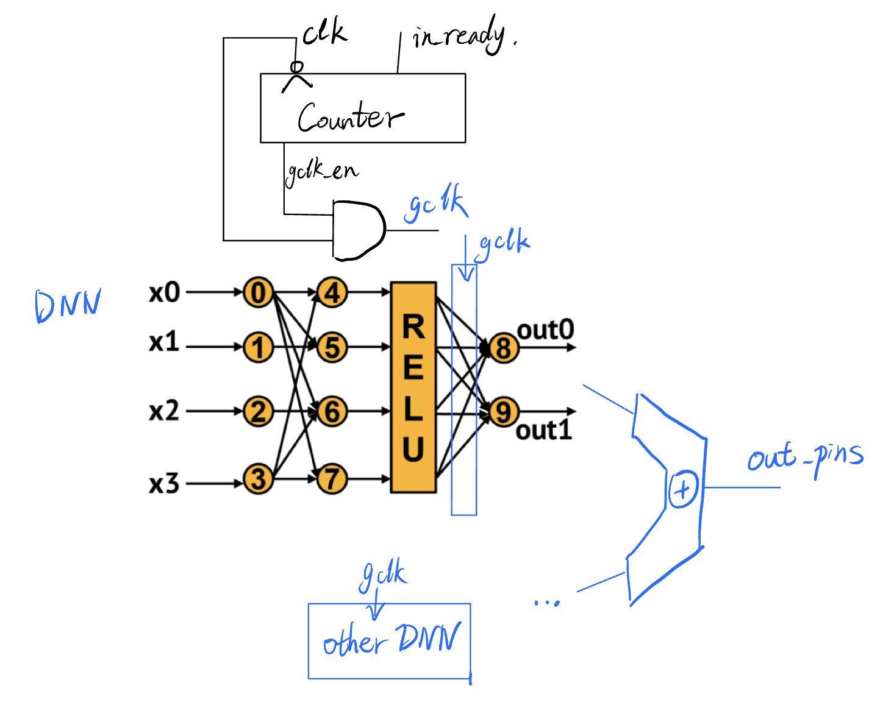
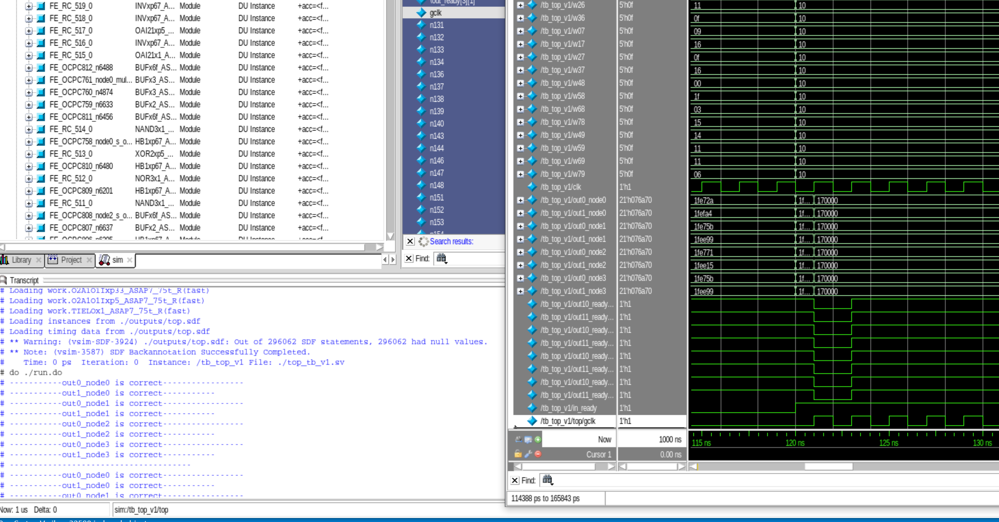

# Report for the Power/Performance Estimations of GNN

## 1. Design Overview
In the RTL design, considering that deeper hidden layers have increased bitwidth, which results in more logic delay for multiplication and sum(), I added flip-flop stages to the DNN with a tendency to relieve the deeper levels' critical paths. Moreover, I implemented an RTL design of DNN with flexible bitwidth and flip-flop stage insertion, as shown in the MS1-MS5 submissions. GNN designs with different frequencies are implemented from the behavioral to the physical layout level. They are then evaluated and compared in this milestone.

&nbsp;
## 2. Design Comparison by PT
From the _reports_730, reports_883, and reports_970_, the PT reports for the 2, 4, and full flip-flop stage designs are included. The required metrics are listed below:

&nbsp;

| Design | Area(mm^2) | Max Frequency(MHz) | Min Latency(ns) | Power(mW) | Energy(pJ) | EDAP(pJ ns-mm^2) |
| ------ | ------ | ------------------ | --------------- | --------- | ---------- | ---------------- |
| full-stages | 0.00244   | 970                | 7.22           | 6.89     | 49.75      | 0.876           |
| 4-stages    | 0.0022  | 883                | 4.53           | 5.79     | 26.23      | 0.261            |
| 2-stages    | 0.00197  | 726                | 2.75           | 3.86     | 10.61      | 0.057            |

&nbsp;

From the table, we can see that the high-frequency design performs poorly in **latency** but performs well in **throughput**, which is not covered in this project's specifications. Additionally, latency is quadratic to EDAP. Moreover, high-frequency design requires more area for flip-flops and routing effort to meet timing closure. Meanwhile, high-frequency mode also indicates larger power. So, considering the EDAP metric, the 2-stage design stands out. **This is important because further optimization is based on these findings from the initial designs and evaluation.**

&nbsp;
## 3. Optimization and improved results
### 3.1. Outcome
According to the files under  _reports_opt724_ folder, the improved results are listed below:
| Design | Area(mm^2) | Max Frequency(MHz) | Min Latency(ns) | Power(mW) | Energy(pJ) | EDAP(pJ ns-mm^2) |
| ------ | ------ | ------------------ | --------------- | --------- | ---------- | ---------------- |
| improved | 0.00193   | 724                | 1.38           | 3.65     | 5.037      | 0.0134           |

&nbsp;

The updated simplified design architecuture is shown in Figure 1:

<p align="center">
  
</p>
<div  align="center"> 
Figure 1. Simplified design architecture
</div>

### 3.2. Optimization
The optimization is based on the following two aspects:

#### 3.2.1. Flip-flops stage
From Figure 1, we can see that only one stage of flip-flops is inserted into the design, located at a deeper level, so that it can effectively decrease the critical path and latency cycle. As a result, from the outcome table, we can see that latency is decreased from 2.74 to 1.38, while the frequency does not change significantly. However, the configuration for APR is different, so it may have some cost in the area. Nonetheless, fewer register requirements also decrease the area. The area is reduced from 0.00197 to 0.00193.

&nbsp;

#### 3.2.2. Gated Clock
From Figure 1, we can see that a gated clock is inserted into the design to decrease power. However, implementing a gated clock is not as simple as adding some logic. One challenging aspect is in the further Synthesis and APR:

1. In Synthesis and APR, we should add more timing constraints for analysis because it is now a multi-clock design. For example, I added the following constraints for the DC shell:
``` tcl
# Find the destination pin of the clk_gated signal
set clk_gated_net [get_nets gclk]
set clk_gated_pin [get_pins -of_objects $clk_gated_net]
# Define gated clock
create_generated_clock -name clk_gated -source [get_ports clk] -divide_by 1 $clk_gated_pin

set_clock_groups -asynchronous -group [get_clocks clk] -group [get_clocks clk_gated]
```
To clarify that, I also attached the sdc file.

2. To avoid contention, from Figure 1, we can see that I generated the gclk_en by clk_negedge. Otherwise, it would encounter hold time violation.

As a result, we can see a drop in power from 3.86 to 3.65, while the timing analysis still passes.

&nbsp;

### 3.3. Validation
Since I have changed the design, I need to go through MS2-MS5 again to validate the design and generate outputs. In short, here I just show the post-simulation results similar to MS3. Other internal reports have been uploaded to the [GitHub repo](https://github.com/ONQLin/GNN_755). If they are required, please check the *optimized_* folders.

<p align="center">
  
</p>
<div  align="center"> 
Figure 2. Post-simulation waveform
</div>

As shown in the waveform, the latency is 1 clk, the clock is gated and all outputs are correct.

&nbsp;

## 4. Further Discussion

1. Regarding the verification part, I have generated the .sdf by PrimeTime for ModelSim to perform back-annotation. However, it seems that ModelSim cannot identify these parasitic delays. Is it due to version incompatibility? Moreover, I cannot open VCS on the CAE machine, which obstructs me from further verification, as we can see in Figure 3.

2. Further optimization options: In this design, 4 DNNs are implemented for GNN. However, DNNs can be shared to save area. It is a common shrinking method implemented by adding more timing control and result latching logic, but it will worsen the latency.

3. Limitation: this design lacks a reset signal from the specifications. Therefore, it cannot maintain some more complicated logic safely.